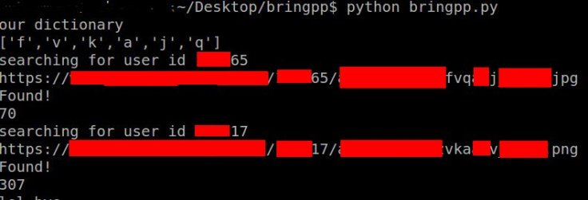

# How I accessed any user's profile picture with PYTHON!

Hello again! Recently I found a vulnerability in a website => **redacted.com**

Well , basically you can set a profile picture in this website and if you set your profile option to "not public" , your profile picture should not be seen by other users.

This vulnerability allows to anyone to access any user's profile picture.Here is how I found it. Let's go step by step

1 - While trying to understand upload mechanism, I saw that when a user uploads a profile picture; the response contains a url

**/directory/userid/imagefilename.jpg**

2- So it means that you can directly access to a profile picture by just visiting

www.redacted.com/directory/userid/imagefilename.jpg

Main and vulnerable protection of profile picture saving mechanism is that giving random imagefilename to your picture before saving it. So it means you can not directly access to a profile picture unless you know exact filename. But I figured out that it was not random enough at all!

3- First of all, **userid** is incremental . Let's say your userid is **X-1** you can try to attack the user with userid X. So , nothing fancy here.

4- Here is where it all begins. **imagefilename** should be random but it is not (at least not for hackers!)

I registered 4 accounts and uploaded 2 **pngs** for first  two accounts and **jpgs** for second two accounts as profile pictures.I saved image urls

I Examined them and saw that (I will change filenames since it is redacted)

    imagefilename for 1. account is **x000000000yy**ab1**zz**q.**png**
    imagefilename for 2. account is **x000000000yy**c2x**zz**w.**png**
    imagefilename for 3. account is **x000000000yy**exg**zz**3.**jpg**
    imagefilename for 4. account is **x000000000yy**g31**zz**r.**jpg**

Did you see that ? There are lots of  same substring.The  "**x000000000yy**" part is the starting part of every image files. and "**zz**" parts are same.

I do not exactly why;  basically  a image file is created according to following pattern :

If a file you upload is png it will be :

fixed12char **random3char** fixed2char **random1char**.png

else if file is jpg it will be :

fixed12char **random3char** fixed2char **random1char**.jpg

**Only 4** characters are **RANDOM**

5-  So what do we know?  The characters are either from lowercase alphabet or digits. It makes  **36** options for each characters.

Since we have 4 character it makes 36 * 36 * 36 *36 = 1679616 possibilities.

But also a file can be either png or jpg it makes =1679616 *  **3359232** possibilities.

6- Let's write a python 2.7 script

I am creating a list contains every possible 4 characters length of permutations of given characters

```python
import itertools
characters = [0,1,2,3,4,5,6,7,8,9,'a','b','c','d','e','f','g','h','i','j','k','l','m','n','o','p','q','r','s','t','u','v','w','x','y','z']
li = []
for i in itertools.product(characters, repeat=4):
    li.append(''.join(map(str, i)))
```

I am assuming the file is "jpg" , iterating the list and sending HEAD request to website.

```python
for i in li:
    url = "redacted.com/directory/userid/x000000000yy"+i[0:3]+"zz"+i[3:4]+".jpg"
    response = requests.head(url)
```

I am checking the content type header

```python
if response.headers['Content-Type'] == "image/jpeg" :
    print "Found!"
    print url
```

tip: I sent **HEAD** request because it is so **much faster** than sending whole **GET** request . It only receives the header of response.

I already know the profile picture urls so to make it clear I decreased my dictionary size for two users  as follows :





7- Conclusion => Let's say you make 100 requests per second (it is so looooooow I know ), in worst case almost **9 hours** will be enough to extract the url of a profile picture of a user!

I wanted to show you how a script language can be useful for hunting and automate things :) Thanks for reading post


