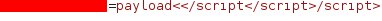

# How I bypassed XSS filter

Hi guys! This is my first ever bug bounty related post. I am planning to add more content to my blog about bug bounty in the future. In this post I wanted to tell the story about a reflected XSS  vulnerability I’ve found in a program . Let’s get started.

While crawling the website I’ve found an endpoint that takes url parameters and embeds them into a javascript object. As you can see I painted targeted parameter  with red color and I painted endpoint information in HTTP request and remaining parameters  in response with black color. I  used “payload” string  to see reflected point in burp suite.

After I saw  that the payload is included in a javascript object I tried to close script with </script>. Unfortunately it was blacklisted and removed. This is exactly where the story begins.

With basic intuition  I  included closing script tag in <> so that I could see the behaviour of filter after removing closing script tag.

Yes  luckily, the filter removes closing script tags and leaves you with <> . All I had to do was to find a  way to add “/script” keyword inside “<>” to be able to close script. So I added /script right before the  “</script>” string that I already know it will be removed.

Hmm. It did not go as I thought it would. It removes  “</script>” as we already know. But after that, it removes “</script”  and only leaves “>” alone. So what happens we add “/script” right before “>”  ?

We are getting closer. Filter works only for once when it comes to removing “/script” string in parameter.Now all we have to do is adding “<” to the head of our payload.

Yes! We managed to close script tag. It means we’ve found a way to write everything we want to see in response. Let’s get an alert with basic svg payload by using same logic.

Here it is !

Probably, this is not the most elegant way to trigger this XSS vulnerability in here but I wanted to write the thinking process of me.
