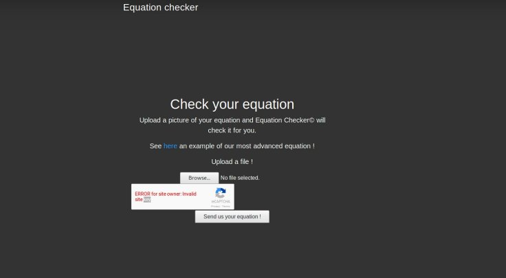
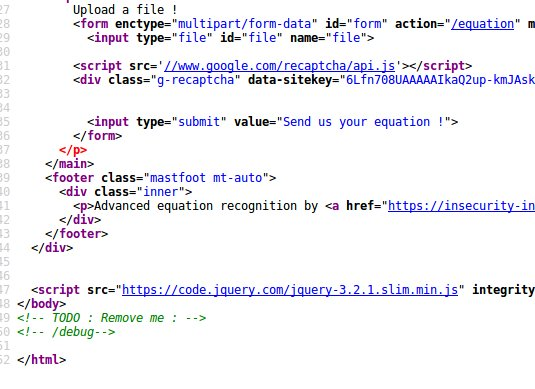
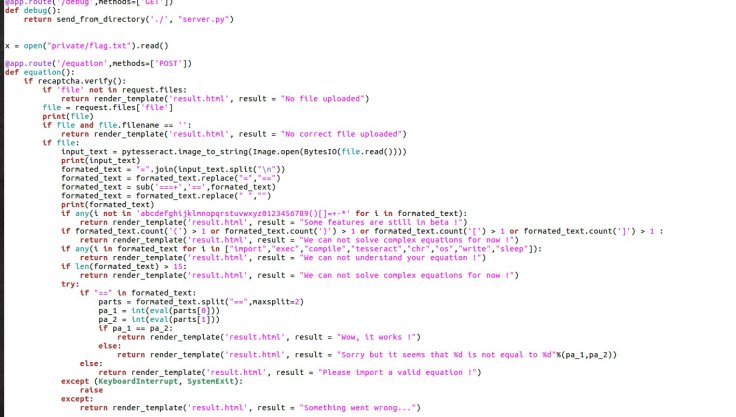
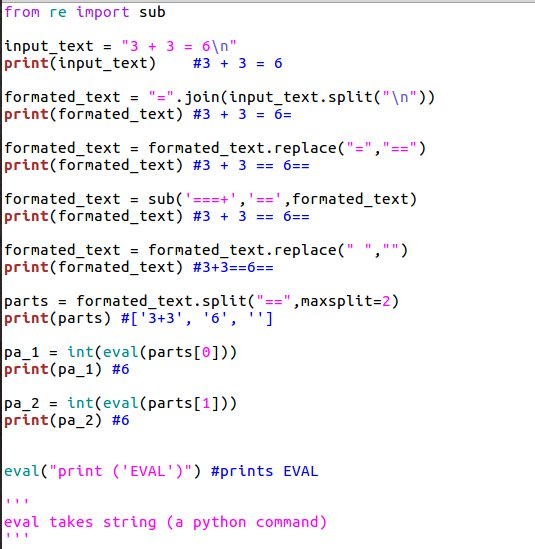
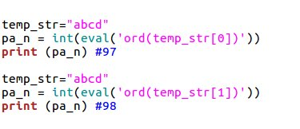
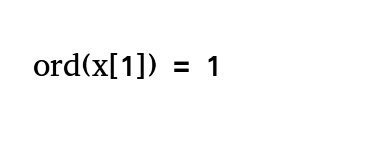

# INS’HACK 2018 OCR-Medium

Hello guys ! I wanted to write a blog post including our solution for OCR-Medium challenge.

Here is problem statement

	Because creating real pwn challs was to mainstream
	we decided to focus on the development of 
	our equation solver using OCR.
	https://ocr.ctf.insecurity-insa.fr/



Here is example image


and when you give this image as input you receive a response like “Wow, it works !”.

Okay let’s understand what we have here. OCR means ‘optical character recognition’. Web page takes an image as input , recognizes characters,  probably parses it and controls whether left side value equals to right side value.

We will check page source if we can see something valuable.



We have /debug file here . We could directly access to that page and saw source code of  page.



What we know here is that we  have a variable x containing flag. To be able to read x file we must arrive to line

```python
return render_template('result.html', 
result = "Sorry but it seems that %d is not equal to %d"%(pa_1,pa_2))
```

So we have to give an equation  with following conditions :


*   Can only contain  ‘abcdefghijklmnopqrstuvwxyz0123456789()[]=+-*’
*   ()[]  characters can occur maximum once.
*   Length can not be more than 15 characters.
*   We can not use [import exec compile tesseract chr os write sleep]
*   We need to give a command to execute in eval that produces a output can be casted to an integer. (except  it raises an error)

Great, now we have to understand the logic of page.

**We  have variable x containing flag**

I am minimizing code a bit.



We  want to read x variable with **eval**

Which integer extracted from a string would be useful to read flag ? Well maybe you can not find it for whole string but for every character of the string.

**We used following python method : ord**

“Given a string of length one, return an integer representing the Unicode code point of the character”



We are creating an image for first character of flag

```python
ord(x[1]) = 1 
```


Server compared those values and printed 73 which is first character ‘I’ of flag format INSA{… .

Until we receive an error we went incrementally ,created images, fetched decimal values of characters , them ,and finally  found the flag!

It was  a pretty nice challenge. I hope I can post more write-ups soon.

