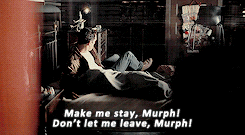

# CSRF Attack for Incremental Parameters

Hello again! Today I wanted to write about a series of techniques regarding a specific case of CSRF attack that I learned recently.

Well, we already know how to make a simple CSRF attack. Firstly we see a post request, and then we check parameters and headers , and try to make a PoC. But what if parameters contain a value that we do not know , or more precisely; what if we need to guess one of the parameters with brute force?

Recently I came across with a CSRF vulnerability that sends user id as a parameter. I searched a way to find out the user id of specific user to attach post request, but I could not find it.

I knew user id was incremental.So let’s say all I know was the user id which belongs to victim is between X and X+10.  It means I should force victim to make multiple post requests with values from X to X+10 . But when multiple values are needed, one form does not simply walk into csrf attack

We have two tasks here

*   We have to create forms with incremental id’s in a single web page , we prefer automated creation 

*   Everytime after sending a request to server , we need to stay at same page to make next request.

The first task seems *easy.* You can  just copy a form and paste it HUNDREDS of times and change id  values manually.

Well as you can guess,  it is not reasonable. It can be made automatically, so with a loop you can create forms easily . You only have to change userid value and form id value because you want to brute force userid values for victim. I wrote a script that takes parameters from command line and creates a html page as above.

Second problem. When you send a  post request via browser,  you are most likely redirected to a page contains response from server. So how could we send another request?

You should force browser to stay at same page. This can be done with **frames**. If you set a iframe as a target of your form, the response client receives is showed in an iframe. Also you do not want to click every single button to send requests. You will probably want automated sending action. We can use jquery in here . Again we do not want to copy paste lots of  jquery actions, iframes,target selection for forms etc.

We are creating html page in this order

*   Add jquery
*   Create iframes
*   Create form tags and connect them with iframes
*   Add userid input into forms incrementally
*   Add jquery submit functions

With this form when a victim opens malicious website , sends multiple forms and brute forces values without knowing it and redirected.

I have added the [python script](https://github.com/csmali/multiple-id-csrf-form) to my repository.  You should do the following in order to use tool

*   Give number of parameters
*   Give url that the request will be made
*   Give form parameter pairs (first value for the parameter that will be increased)
*   Give parameter name that will be increased
*   Give number of increment (number of forms will be created)

