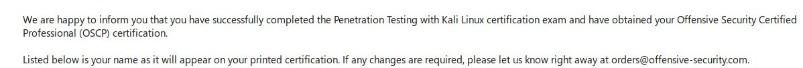
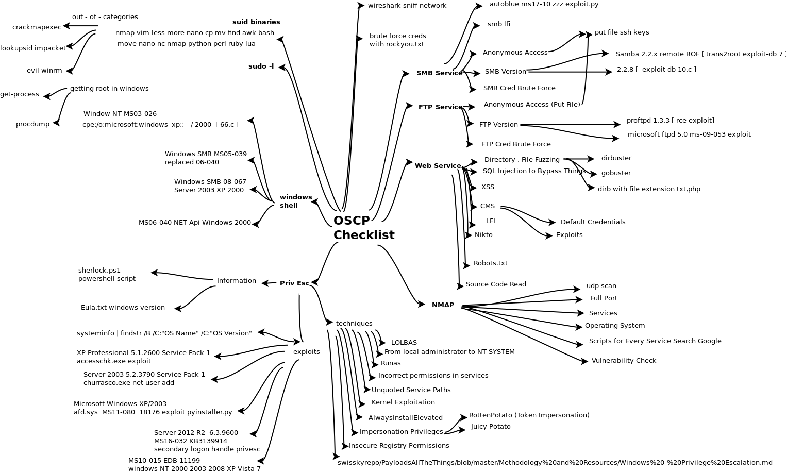

# OSCP Adventure

Hi again! For newcomers, I am **csmali_** on twitter. I finally passed OSCP exam in my second attempt! It was, without a doubt, a great journey and experience.
In this post I will try to explain my methodology, my mistakes in first exam, and the things I did correctly in second attempt.
I hope this article will be useful for those who will take the exam.

### Background

Well, actually I did not start to OSCP-like exercises with OSCP Lab machines. I am already familiar with following concepts :

* **Bug Hunting and Recon**
 It helped me to understand the concepts of CMS, architecture and vulnerabilities of web applications etc. Therefore
 I have knowledge about directory fuzzing, port scanning with different configurations. I also have experience about some automatization tools.

* **CTF Practices - Capture the Flag**
 Although I haven't been able to attend much recently, I have participated in many CTF's. Also I am still practicing on HTB(hackthebox).

### Lab Journey

I had 3 months of lab time. At first I was able to get 2 or 3 machines a week at most even if I had pre-knowledge about OSCP-like machines from hackthebox. I was so slow when you think that in exam you need to collect approximately 3 completely compromised machine and BoF(Buffer Overflow) points , in 24 hours. As time went on, I started to do things faster, things like recon, directory fuzzing, nmap etc. But again some of the machines were painful. Offsec forum is an option that you can find some info about machines. However, I continued to spend lots of time on the machines until I was convinced that I had no other choice. Then when I stucked, I used the clues on forum. At the end of 2 months, I had almost 30 machines and I also understand the concept of Buffer Overflow exercise on lab. It is easy when it is compared to compromising machines, believe me. Then some of my collegues said that it will be enough for exam. I decided to take an exam before my lab time expires.

### Failure - Attempt 1

I failed first time so hard. I succesfully compromised 10 point machine and BoF question(25 points) in 4 hours. 10 point machine is relatively easy. It allows you get root access in short time. But after 4 hours I just stucked. For almost 12 hours all I did was looking at screens. I could collect no more points. I will explain why things went wrong.
* **Rabbit Holes**
A Rabbit Hole is basically a time consuming path that leads nowhere where you think there will be treasure at the end of it. It maybe a brute force attempt, a software that has no vulnerability etc. I already now OSCP-like machines sometimes have rabbit holes. It is easy to say that "avoid rabbit holes". But you can not avoid before you enter one of them. In my first attempt after I got my first 35 points, I started to looking at 20 points machines at the sametime. I was too smart and blind that I thought after initial recon, I have found entry points of machines. But they were not, at all.

* **Psychology Effect**
Think about that, you collect half of the points you need (35 points) in a time less than 3 hours. But you collect no more points for almost 12 hours. The truth is, I felt that I have failed after 12 hours of exam. Why the f*** on earth? I could do more recon, check previous scan output one more time, try to expand attack surface etc. But all I did was feeling total breakdown. So you when are you in that mood, no one gives you reverse shells.

* **Recon**
It turns out, I was not good at recon. The main reason that pushed me into rabbit holes, was I had nothing else to look into. If you have 2 or 3 options, ports, webpages,applications,services etc. you feel more comfortable. After that even if you are in a rabbit hole, you remember that you have other things that needs to be examined. This is the only way out from rabbit hole.

### Success - Attempt 2

I knew that I could do more in my first exam. I immediately bought exam retake for a month later and started to watch **IPPSEC** videos on youtube. I strongly recommend his channel. He solves retired hackthebox machines, tries different methods and tools. For example I saw the tool **"reconnoitre"** tool in his channel for the first time. This tool is not a magic wand but it creates folder structure for the machine you scan, automates nmap scans, offers you some additional scan for different tools, ports and configurations.

I had still time on lab environment, I solved some machines again. I tried the remember and memorize enumeration process. I also solved 3-4 machines on hackthebox to refresh my mind.

Exam day has come. It was 10:00 o'clock. Although I failed hard in first attempt, I had self-confidence. I knew I could solve BoF and 10 points machine easily,so I started with 20 points machine, enumerated all ports, services, entry points with different configuration of different tools, found my entry points in 1 hour and I successfully compromised the machine.

I started to look into second 20 points machine, I saw nothing juicy so I reserved it for a bit later. I solved BoF machine and 10 points machine in **2 hours**, totally I had **55 points**.

When you enumerate properly you make things easier. Before the exam I had thought that I was never gonna be able to compromise 25 points machine. But in exam I saw the entry point of the machine and I captured the local.txt easily in less than an hour.

In **5 hours** I had almost **67.5** points. What I had to do was trying to escalate my privileges on 25 point machine OR start to look into 20 point machine. I decided to leave 25 points machine aside since it is probably the hardest task in exam. I started to recon process for 20 points machine. I started the run nmap with different configurations, with every nse script related with services found in machine, gobuster for every web directory, tools in Kali etc. I started to hear fan sound from my laptop. I asked for permission from the observer of offsec, walked around the house a little, chatted with my mother, drank water and came back. I checked the results and immediately realized that I was going to get my 10 points in a short time. And finally in **7 hours** I had my **77.5** points which allows me to pass the exam.

I was not sleepy, with that adrenaline rush I was awake more than ever. I started to write my exam report. Since I was taking screenshots for every step, writing report was pretty easy, I just filled the report with pictures and clarified points where necessary. In 18 hours, at 02:00 am, I finished my exam and had my report ready. I sent the report and went for a sleep. After 2 days I saw this e-mail

OSCP is training I would recommend to anyone interested in cyber security. It makes you learn lots of thing. I can not wait to attend other courses of offsec team!

### OSCP Checklist

I created a checklist. I hope it will be useful for you.

### Links

These are the links I constantly check in my enum process.

[OSCP Survival Guide](https://github.com/wwong99/pentest-notes/blob/master/oscp_resources/OSCP-Survival-Guide.md)

[g0tmi1k Basix Linux Privilege Escalation](https://blog.g0tmi1k.com/2011/08/basic-linux-privilege-escalation/)

[Privilege Escalation abusing sudo rights](https://github.com/Ignitetechnologies/Privilege-Escalation/blob/master/Abusing%20Sudo%20Righs.md)

[Privilege Escalation Windows](https://www.fuzzysecurity.com/tutorials/16.html)

[Privilege Escalation Windows](https://pentest.blog/windows-privilege-escalation-methods-for-pentesters/)

[Privilege Escalation Windows](https://guide.offsecnewbie.com/privilege-escalation/windows-pe)

[SMB Enumeration](https://0xdf.gitlab.io/2018/12/02/pwk-notes-smb-enumeration-checklist-update1.html)

[List of Common Ports](https://sushant747.gitbooks.io/total-oscp-guide/list_of_common_ports.html)

[Privilege Escalation Windows](https://github.com/swisskyrepo/PayloadsAllTheThings/blob/master/Methodology%20and%20Resources/Windows%20-%20Privlege%20Escalation.md)

[Total OSCP Guide](https://sushant747.gitbooks.io/total-oscp-guide/)

[Upgrading Shell](https://blog.ropnop.com/upgrading-simple-shells-to-fully-interactive-ttys/)
