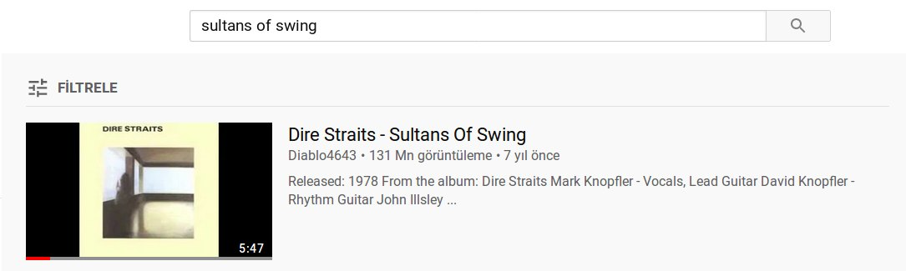
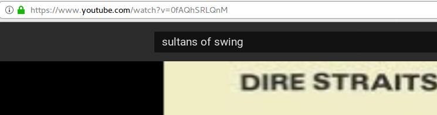
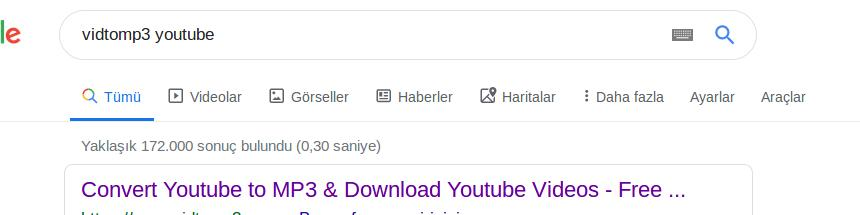
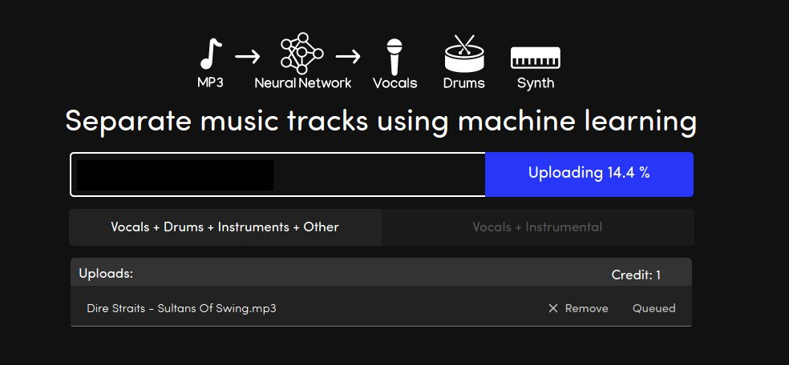
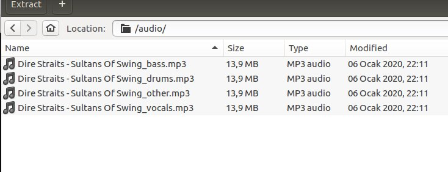
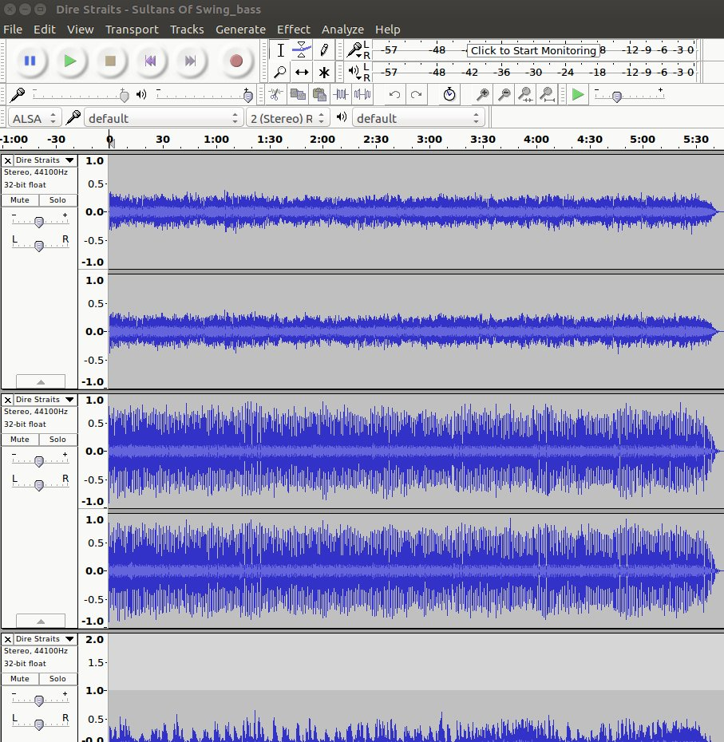
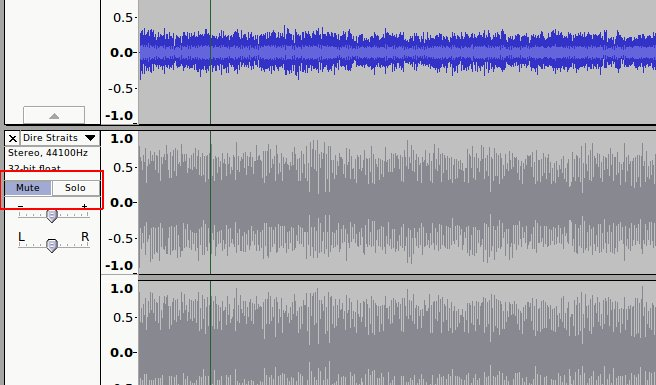

# Create Your Custom Karaoke Song in Seconds!

Hello folks! Today I will write about something rather than security.

I am an amateur musician, I usually play classical guitar and drum in my free time. I also play piano rarely.

Whenever I try to play a well-known song with an instrument -let's say drum- I search for "Drumless Sultan's of Swing" which is one of my favorite songs, on youtube.
If I am lucky, I download this music to my mobile phone and play it on speakers. I accompany with my drum to this song.

But most of the time, I can not find drumless version of the songs and it bothers me. So thankfully I discovered [melody.ml](https://melody.ml/) built-with a Deep Learning tool [Deezer Spleeter](https://github.com/deezer/spleeter). In this post I will show how to create custom karaoke songs with **melody.ml**

### Steps

Download mp3 to computer from youtube

*   Find your music video and download it via some video to mp3 website

Upload mp3 to melody.ml from computer

*   Wait for the process and download when it is ready

*   Content of the downloaded file

*   Drag and drop files to Audacity. Audacity is free program that you can use for both
Windows and Linux platforms.

*   Let's say that you want to exclude DRUM sound from song. Find the drum layer and click mute.

*   Click play button and test it you will hear no drum!. After that from File -> Export , export your song as mp3.
That's it. Now you can enjoy your drumless custom karaoke song!. You can make all of the combinations for the instruments and vocal of a song with this method.
